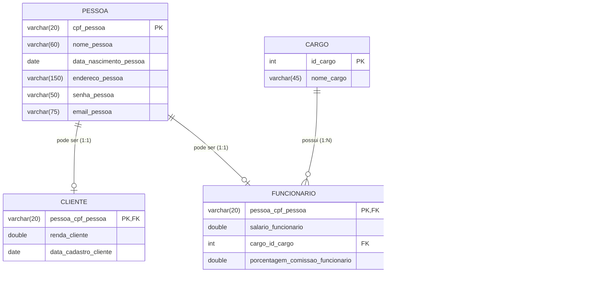

# StyleShop

Sistema web de gestão para uma loja de roupas, desenvolvido para o Projeto de DW1 (3º bimestre de 2026).
Aplicação **Cliente/Servidor** no padrão **MVC**, com **Node.js + Express** no servidor, **PostgreSQL** no banco e **HTML/CSS/JavaScript** puro no navegador.

**Aluno:** Gabriel de Almeida Alves — **Turma:** M32-2026

## Módulos

Cada módulo tem uma tela com CRUD completo (consultar, incluir, alterar e excluir):

| Módulo | O que gerencia |
| :--- | :--- |
| **Produtos** | Roupas à venda (nome, categoria, tamanho, cor, estoque, preço) e a **imagem** de cada uma (upload local) |
| **Categorias de Roupa** | Categorias dos produtos, identificadas por uma sigla de até 4 letras (ex.: `FEM`, `MASC`) |
| **Cargos** | Cargos dos funcionários |
| **Pessoas** | Cadastro de pessoas, que podem ser **Funcionário** e/ou **Cliente** |

Regras principais:

- Na tela de Pessoa, é obrigatório marcar **Funcionário e/ou Cliente**. Cada opção marcada pede os dados do respectivo papel.
- O **CPF** (ID da pessoa) deve ter **11 números**.
- Um **cargo** ou uma **categoria** que está em uso (por um funcionário ou um produto) **não pode ser excluído**.
- A imagem de cada produto fica em `imagens/<id_do_produto>.png`. Produto sem imagem mostra `silhueta.png`.

## Estrutura do projeto

```
LojaRoupas/
├── backend/
│   ├── controllers/   # lógica de negócio de cada módulo
│   ├── routes/        # mapeamento dos endpoints de cada módulo
│   ├── database.js    # conexão com o PostgreSQL (lê o .env)
│   ├── server.js      # inicia o servidor Express e registra as rotas
│   └── .env           # variáveis de ambiente (NÃO vai para o Git)
├── frontend/
│   ├── menu/          # página inicial com o menu dos módulos
│   ├── produto/
│   ├── categoria_roupa/
│   ├── cargo/
│   └── pessoa/        # cada pasta tem .html, .css e .js
├── imagens/           # imagens dos produtos
├── documentacao/
│   └── styleshop_definitivo.sql   # criação das tabelas + carga inicial
├── package.json
└── .gitignore
```

Fluxo de uma requisição: a página (`.html` + `.js`) chama o servidor com `fetch` → o **router** (`routes/`) encaminha para a função do **controller** (`controllers/`) → o controller executa o SQL no PostgreSQL → a resposta volta em JSON e a página atualiza a tela.

## Banco de dados

Banco `styleshop`, com 6 tabelas (todas usadas pelo sistema) e **10 registros iniciais em cada uma**.

### Diagrama



### Relacionamentos

| Tipo | Tabelas | Como funciona |
| :--- | :--- | :--- |
| **Independentes** | `pessoa`, `cargo`, `categoria_roupa` | Não dependem de nenhuma outra tabela |
| **1:1** | `pessoa` → `cliente` e `pessoa` → `funcionario` | A chave primária da tabela filha é também a chave estrangeira (o CPF da pessoa) |
| **1:N** | `cargo` → `funcionario` | Um cargo pode ter vários funcionários |
| **1:N** | `categoria_roupa` → `produto` | Uma categoria pode ter vários produtos |

Ao excluir uma **pessoa**, os registros de cliente e funcionário dela são excluídos junto (`ON DELETE CASCADE`). Já `cargo` e `categoria_roupa` **não** têm exclusão em cascata: o banco recusa apagar um cargo ou categoria que ainda está em uso.

### Como criar o banco

1. No PostgreSQL (pgAdmin ou `psql`), crie um banco vazio chamado `styleshop`:

   ```sql
   CREATE DATABASE styleshop;
   ```

2. Conectado nesse banco, execute **uma vez** o arquivo `documentacao/styleshop_definitivo.sql`. Ele cria as tabelas, as chaves e insere os dados iniciais.


## Como executar

Pré-requisitos: **Node.js** e **PostgreSQL** instalados.

1. Crie o banco e execute o `.sql` (passos acima).
2. Crie o arquivo `backend/.env` com os dados do **seu** PostgreSQL:

   ```
   DB_HOST=localhost
   DB_PORT=5432
   DB_NAME=styleshop
   DB_USER=seu_usuario
   DB_PASSWORD=sua_senha
   PORT=3001
   ```

3. Na pasta do projeto, instale as dependências:

   ```
   npm install
   ```

4. Inicie o servidor:

   ```
   npm start
   ```

   (ou `npm run dev` para reiniciar sozinho a cada alteração). No terminal deve aparecer **"Servidor executando na porta 3001"** e **"Banco de Dados styleshop conectado com sucesso!"**. Se aparecer "FALHA NA CONEXÃO", confira usuário e senha no `.env`.

5. Abra no navegador o arquivo `frontend/menu/menu.html` (clique duas vezes nele ou use a extensão *Live Server* do VS Code). Essa é a página inicial, com o menu dos módulos.

> O servidor precisa estar rodando para as telas funcionarem: as páginas buscam os dados em `http://localhost:3001`.

## Endpoints

O servidor registra uma rota base para cada módulo (cada uma com listar, consultar, incluir, alterar e excluir):

| Rota base | Módulo |
| :--- | :--- |
| `/produto` | Produtos (inclui o envio de imagem em `/produto/upload/:id`) |
| `/categoria_roupa` | Categorias de Roupa |
| `/cargo` | Cargos |
| `/pessoa` | Pessoas |
| `/cliente` | Clientes (usado pela tela de Pessoa) |
| `/funcionario` | Funcionários (usado pela tela de Pessoa) |
| `/imagens` | Arquivos de imagem dos produtos |

## Observações

- O `.gitignore` já ignora `node_modules/` e `.env`. **Nunca envie o `.env` ao GitHub**, porque ele contém a senha do banco.
- O pacote `sharp` (usado para converter as imagens) instala um arquivo diferente em cada sistema operacional: rode `npm install` na máquina onde o projeto vai executar, em vez de copiar a pasta `node_modules`.